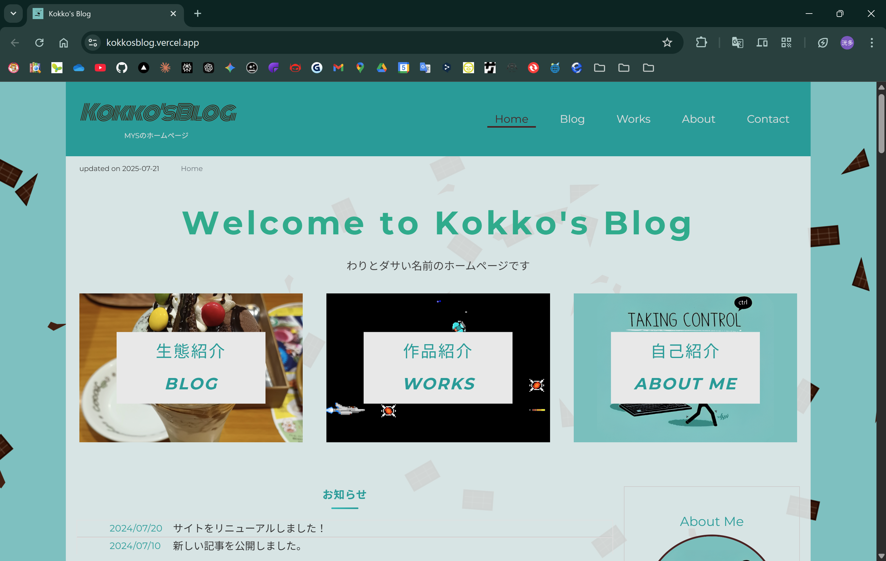
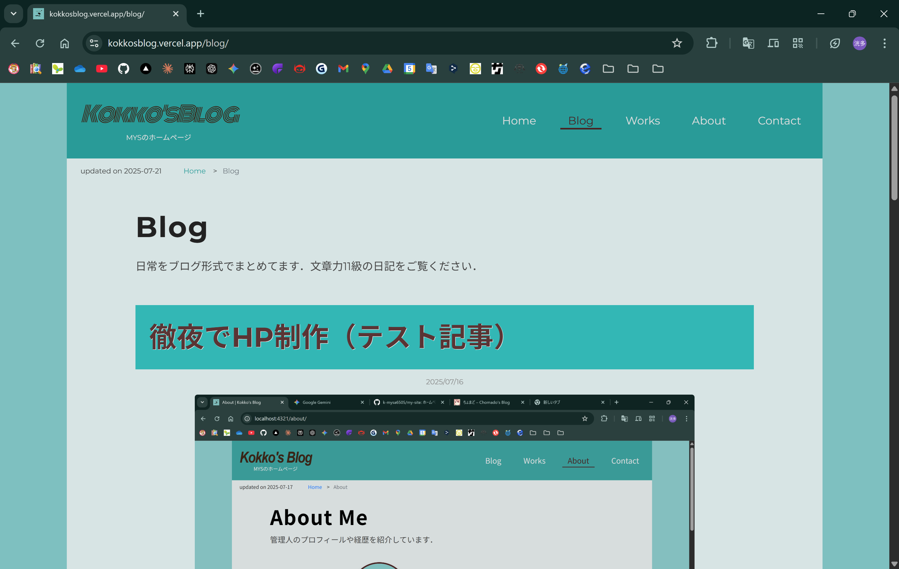
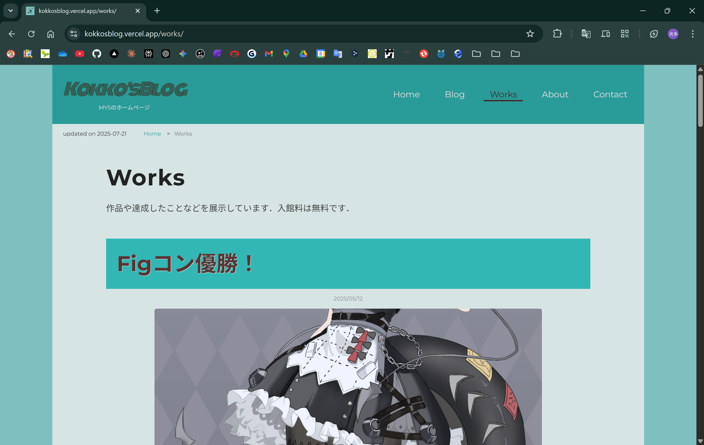
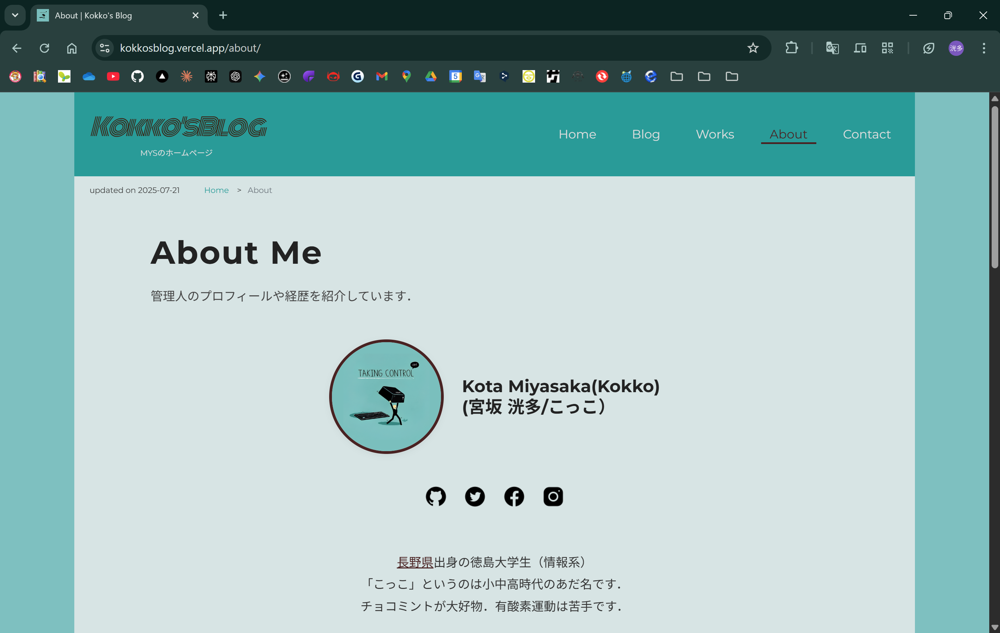
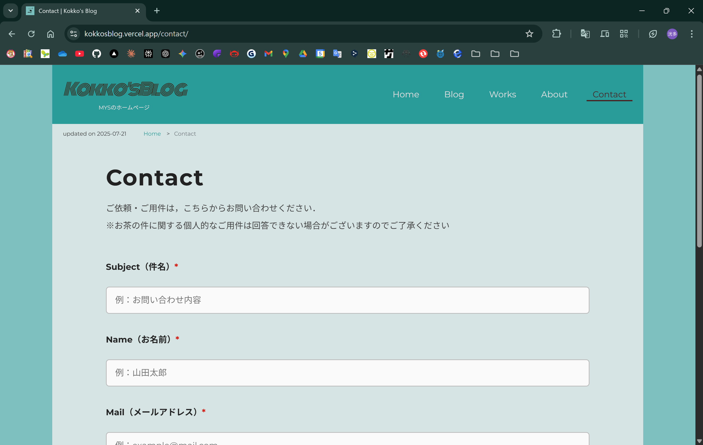
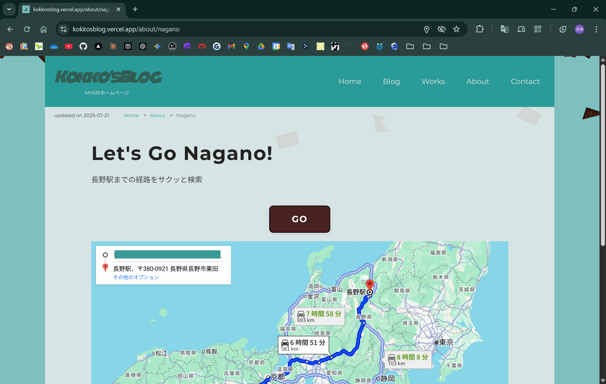

研究室内でHPコンテストがあったので，ホームページを作ってみました．
当日テンパってもいいようにここで色々説明しておきます．

## コンセプト
私といえばチョコミントなので，色使いの雰囲気としてチョコミントを採用しました．
ミント色を基調として，アクセントにチョコレート色を使用しています．
また，サイトの背景には板チョコが散りばめられています．これによって作りこまれた感を演出しています．

## ページ構成
ページは主に以下の5つです．
- Home（メインページ）
- Blog（管理人の日常をさらした記事一覧）
- Works（これまでつくってきたもの・達成したことの記事一覧）
- About（管理人のプロフィールや経歴紹介）
- Contact（お問い合わせページ）

### Home
メインページは，ほかのサブページ（Blog, Works, About）への案内や，
すべての記事を一覧表示しています．
また，管理人の簡単な自己紹介も行っています．
SNSリンクアイコンも設置していますが，それはダミーです．私のアカウントには届きません．

### Blog
Blogページは，管理人の日常といった需要ゼロな記事を一覧表示しています．
各記事に遷移することで全文読むことができます．

ちなみに，これらの記事はマークダウンで書いており，HTMLで書かなくても整った見た目の記事にできます．

### Works
Worksページでは，今までにつくったもの（ゲームとか絵とか）や，達成したことなどを，記事にまとめて一覧表示しています．
もしかしたら需要があるかもしれませんね．こちらも各記事に遷移することで全文読むことができ，ソースへのリンクも置いたりしています．

### About
自己紹介ページです．経歴はネタです．笑ってください．

### Contact
お問い合わせのページです．ホームページを開設するなら作ろうと思って作りました．

STOP!：悪ふざけで送信するのはやめましょう．本当に届きます．

### その他
私の紹介で「長野県」という単語にリンクが振ってあります．
これをクリックすると，その場から長野駅までの経路を検索できるムダ機能を使うことができます．
使用するには現在地を使用するので，ブラウザの位置情報の使用を許可してください．
レッツゴー長野県.

ほかにも，プライバシーポリシーや利用規約を定めたページもあります．
お問い合わせページで，「プライバシーポリシー・利用規約に同意する」という文を入れたいがためにわざわざ作りました．
中身は半分適当です．

## 使用技術
マークアップ系はHTMLとCSS，フロントエンドのフレームワークにはAstroというものを使用しています．

Astroとは，Webサイトやブログなどの静的なサイトを高速かつ簡単に作成できるフレームワークです．ReactやNext.jsに似ていますが，必要最小限のJavaScriptを組み込む仕組みであるという違いがあります．

ホームページくらいならReactやNext.jsは大げさかなあと思って，Astroを初めて使ってみましたが，思いのほか機能拡大に熱が入りすぎて，Next.jsにすればよかったと後悔しています．特にサーバーサイド関連．

デザイン面では，CSSのFlexboxやGridを活用してレスポンシブ対応しています．お時間があればスマートフォンでもご覧ください．

API関連は，経路検索にGoogle Maps API，メール送信にResend APIを使用しています．

## Special Thanks
- アイコン：[Icons8](https://icons8.com/)
- プログラミング言語ロゴ：[Devicon](https://devicon.dev/)
- AI：[Cursor](https://cursor.com/ja)（chatGPT），[Gemini](https://gemini.google.com/app?hl=ja)，[Claude](https://claude.ai/)（Claudeに聞けばだいたい解決する）
